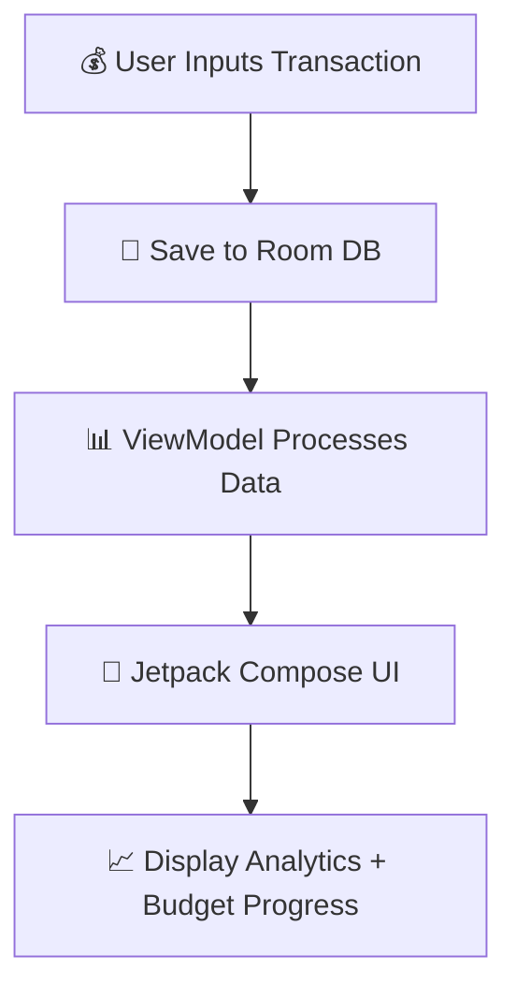
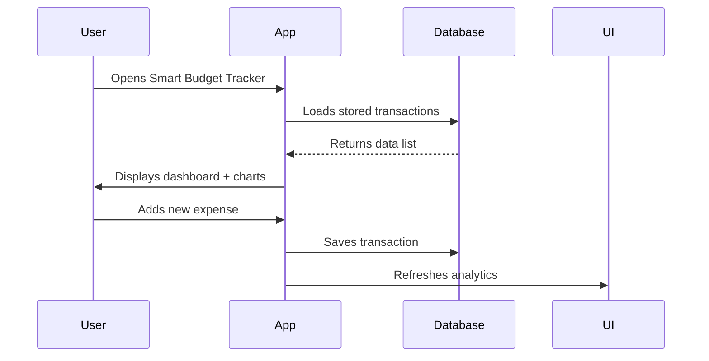

# 💰 Smart Budget Tracker


> ⚙️ **Smart Budget Tracker** is a modern Android app built with **Kotlin** and **Jetpack Compose** to help users track income, expenses, and budgets effortlessly.  
> It focuses on **simplicity**, **data visualization**, and **intuitive financial management**, all without needing an internet connection.

---

## 🧩 Key Features

| Feature | Description | Tools Used |
|----------|--------------|------------|
| 💸 **Expense Tracking** | Log your income and expenses easily. | Kotlin, Room DB |
| 📊 **Analytics Dashboard** | Visualize your spending with charts. | Jetpack Compose |
| 🗓️ **Budget Goals** | Set and track monthly or weekly goals. | SharedPreferences |
| 📁 **Offline Support** | Works fully offline — your data stays local. | Room Database |
| 🎨 **Modern UI** | Built with Jetpack Compose and Material Design 3. | Compose UI |
| ⚙️ **Lightweight & Secure** | No external APIs or cloud dependencies. | Pure Android |

---

## 🧠 App Architecture



---

## 🏗️ Project Structure

```
budget/
│
├── app/
│   ├── src/
│   │   ├── main/
│   │   │   ├── java/com/example/budget/
│   │   │   │   ├── ui/          # Jetpack Compose screens
│   │   │   │   ├── data/        # Room database, DAO
│   │   │   │   ├── model/       # Data models
│   │   │   │   └── viewmodel/   # MVVM ViewModels
│   │   │   └── res/             # Layouts, drawables, strings
│   ├── build.gradle.kts
│   └── AndroidManifest.xml
│
├── build.gradle.kts
├── settings.gradle.kts
└── flowchart.txt
```

---

## 🧱 Tech Stack

| Layer | Technology |
|-------|-------------|
| **Language** | Kotlin |
| **UI Framework** | Jetpack Compose |
| **Architecture** | MVVM (Model–View–ViewModel) |
| **Database** | Room (SQLite) |
| **Build System** | Gradle (Kotlin DSL) |
| **IDE** | Android Studio |

---

## ⚙️ Setup Instructions

### 1️⃣ Clone the repository
```bash
git clone https://github.com/yourusername/smart-budget-tracker.git
cd smart-budget-tracker
```

### 2️⃣ Open in Android Studio
- Open the project folder in **Android Studio**  
- Allow Gradle to sync automatically  

### 3️⃣ Run the app
- Choose a device or emulator  
- Click **Run ▶️** or use:
```bash
./gradlew assembleDebug
```

---

## 🧪 Example Workflow

1️⃣ Add your daily expenses or income  
2️⃣ View your balance and total spending  
3️⃣ Analyze your financial activity via charts  
4️⃣ Adjust goals and save smarter  

---

## 📸 Visual Overview

| Dashboard | Expense Chart | Add Expense |
|------------|----------------|--------------|
|  |  |  |

---

## 🧩 Data Flow Summary



---

## 🚀 Future Enhancements

- [ ] Add dark mode 🌙  
- [ ] Add backup/export to CSV  
- [ ] Category-based filters and graphs  
- [ ] Notifications for budget limits  
- [ ] Integration with Google Pay or UPI  

---

## 👨‍💻 Author

**Developed by:** Avanish Sahai  
🎓 *Android Development Project — Personal Finance Management App*  

---

## 📜 License

This project is licensed under the **MIT License**.

---

⭐ **Smart Budget Tracker** — *Track. Save. Succeed.*
